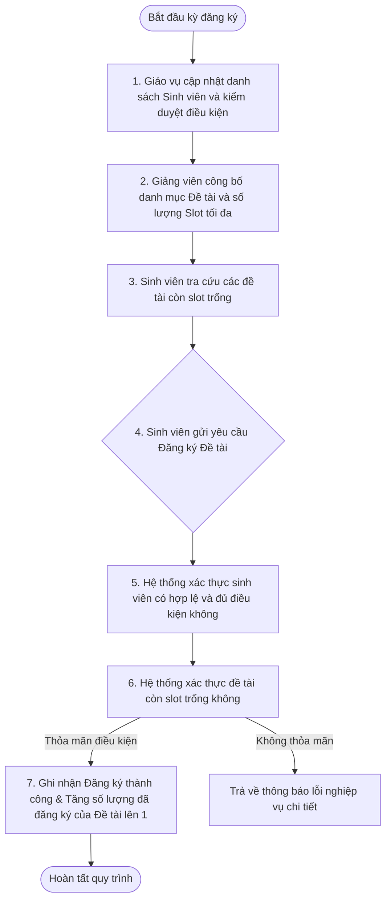
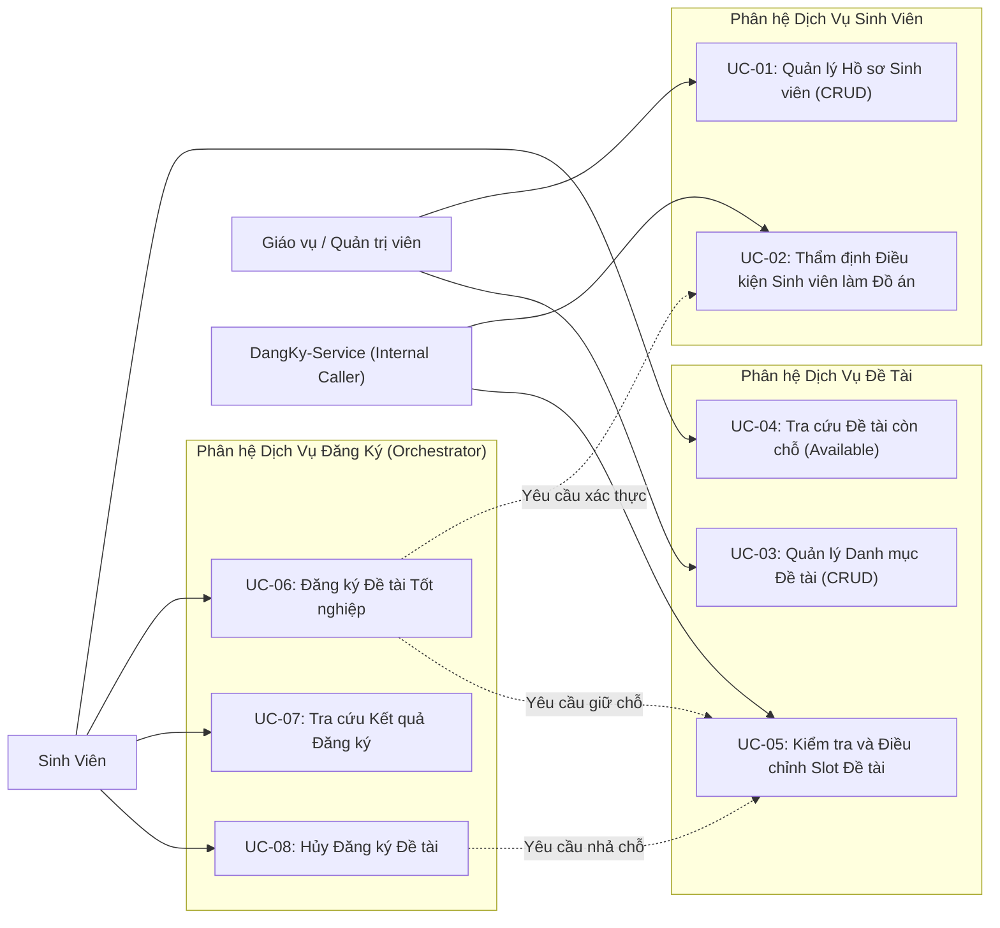
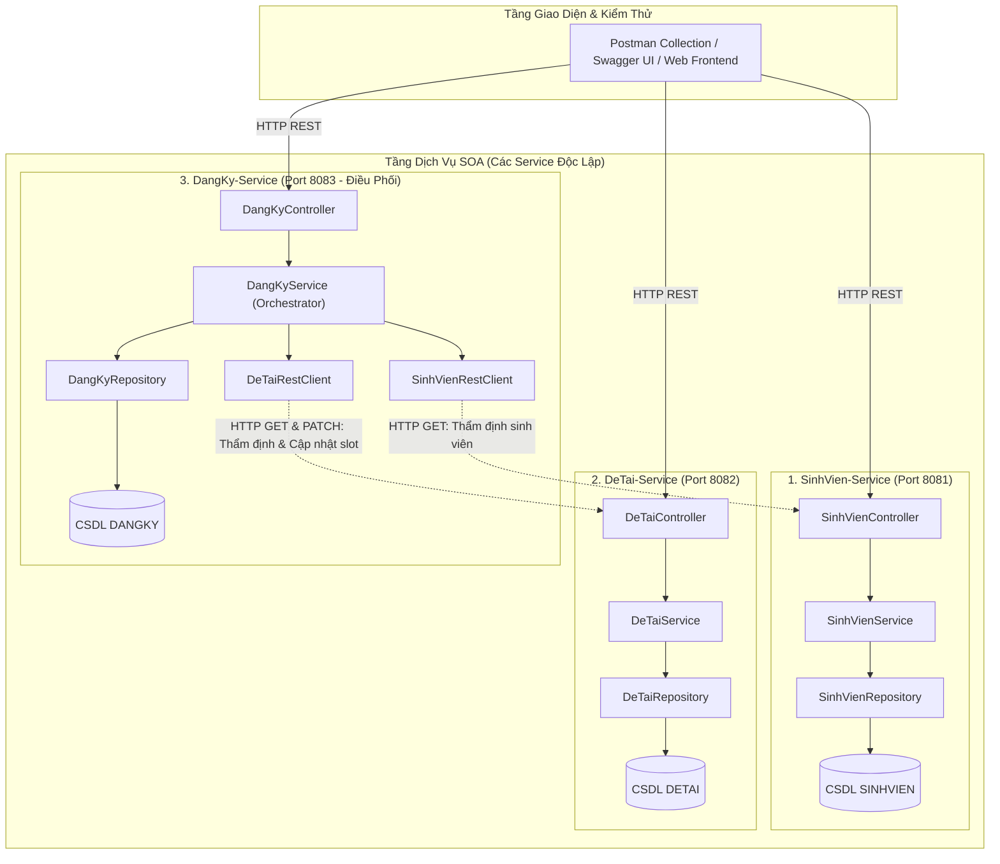
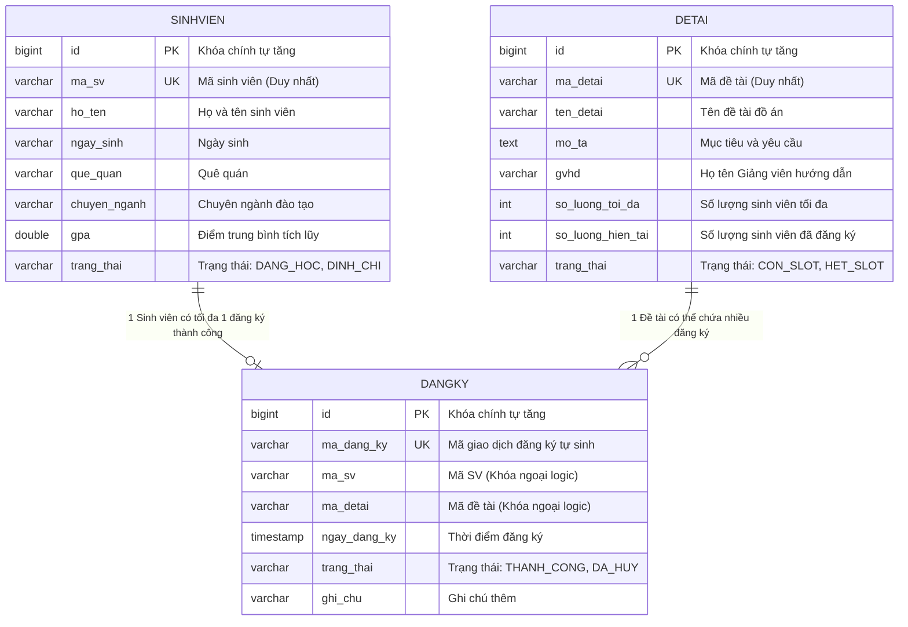
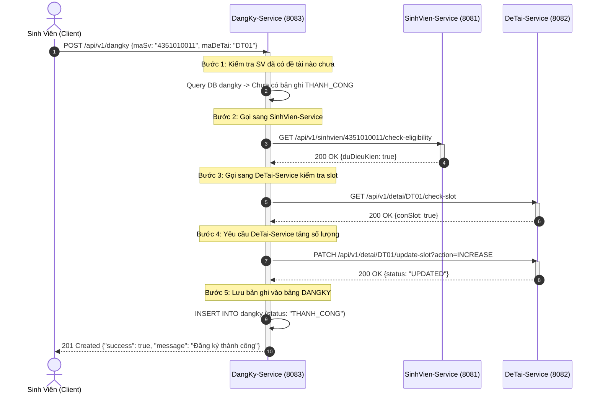
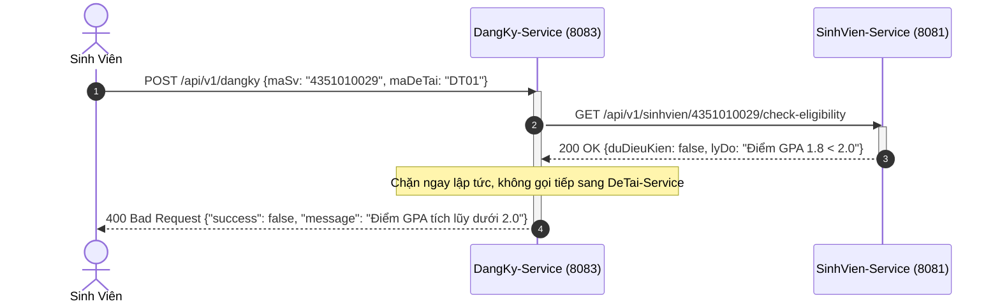
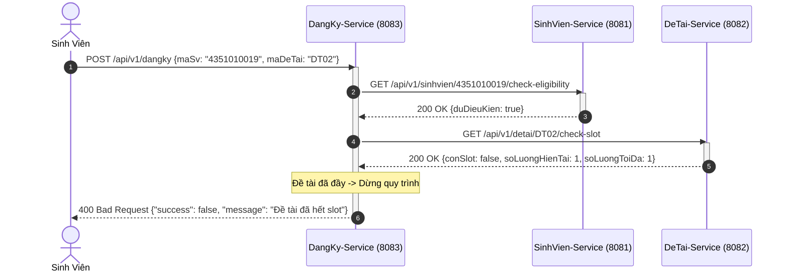
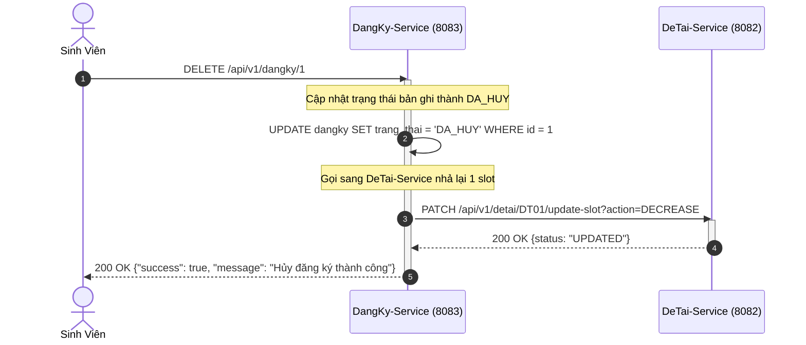

# TÀI LIỆU PHÂN TÍCH VÀ THIẾT KẾ HỆ THỐNG (SAD)
## HỆ THỐNG QUẢN LÝ ĐỒ ÁN TỐT NGHIỆP (KIẾN TRÚC HƯỚNG DỊCH VỤ - SOA)

---

## MỤC LỤC

1. [TỔNG QUAN VÀ MÔ TẢ BÀI TOÁN NGHIỆP VỤ](#1-tổng-quan-và-mô-tả-bài-toán-nghiệp-vụ)
   - 1.1. Bối cảnh và Phạm vi
   - 1.2. Quy trình nghiệp vụ thực tế
   - 1.3. Các quy tắc nghiệp vụ bắt buộc (Business Rules)
2. [PHÂN TÍCH YÊU CẦU HỆ THỐNG (SYSTEM ANALYSIS)](#2-phân-tích-yêu-cầu-hệ-thống-system-analysis)
   - 2.1. Danh mục Tác nhân (Actors)
   - 2.2. Biểu đồ Ca sử dụng tổng quát (Use Case Diagram)
   - 2.3. Đặc tả chi tiết từng Ca sử dụng (Use Case Specifications)
3. [THIẾT KẾ KIẾN TRÚC HƯỚNG DỊCH VỤ (SOA DESIGN)](#3-thiết-kế-kiến-trúc-hướng-dịch-vụ-soa-design)
   - 3.1. Phân rã dịch vụ và ranh giới trách nhiệm (Service Decomposition)
   - 3.2. Sơ đồ kiến trúc dịch vụ tổng thể
   - 3.3. Cơ chế giao tiếp liên dịch vụ qua HTTP/REST
4. [THIẾT KẾ CƠ SỞ DỮ LIỆU (DATABASE DESIGN)](#4-thiết-kế-cơ-sở-dữ-liệu-database-design)
   - 4.1. Sơ đồ thực thể liên kết (ERD)
   - 4.2. Từ điển dữ liệu chi tiết 3 bảng: SINHVIEN, DETAI, DANGKY
   - 4.3. Ràng buộc toàn vẹn dữ liệu
5. [ĐẶC TẢ CHI TIẾT HỢP ĐỒNG API (API SPECIFICATIONS)](#5-đặc-tả-chi-tiết-hợp-đồng-api-api-specifications)
   - 5.1. Dịch vụ Quản lý Sinh viên (SinhVien-Service - Port 8081)
   - 5.2. Dịch vụ Quản lý Đề tài (DeTai-Service - Port 8082)
   - 5.3. Dịch vụ Đăng ký Đồ án (DangKy-Service - Port 8083)
6. [THIẾT KẾ ĐỘNG - BIỂU ĐỒ TUẦN TỰ (SEQUENCE DIAGRAMS)](#6-thiết-kế-động---biểu-đồ-tuần-tự-sequence-diagrams)
   - 6.1. Luồng đăng ký đề tài thành công (Happy Path)
   - 6.2. Luồng đăng ký thất bại do sinh viên không đủ điều kiện
   - 6.3. Luồng đăng ký thất bại do đề tài đã hết chỗ
   - 6.4. Luồng hủy đăng ký đề tài và hoàn trả chỉ tiêu
7. [THIẾT KẾ TẦNG ỨNG DỤNG VÀ MÔ HÌNH DỮ LIỆU (APPLICATION ARCHITECTURE)](#7-thiết-kế-tầng-ứng-dụng-và-mô-hình-dữ-liệu-application-architecture)
   - 7.1. Kiến trúc phân lớp chuẩn mực (Layered Architecture)
   - 7.2. Đặc tả các tầng giao tiếp và đối tượng trao đổi (DTOs)

---

## 1. TỔNG QUAN VÀ MÔ TẢ BÀI TOÁN NGHIỆP VỤ

### 1.1. Bối cảnh và Phạm vi
Hệ thống **Quản lý Đồ án Tốt nghiệp** được xây dựng nhằm chuẩn hóa và tự động hóa quy trình phân công và đăng ký đề tài tốt nghiệp cho sinh viên thuộc khoa đào tạo đại học. Hệ thống tập trung giải quyết:
- Quản lý hồ sơ sinh viên đủ điều kiện làm đồ án.
- Quản lý danh mục đề tài do các giảng viên hướng dẫn (GVHD) đề xuất kèm theo chỉ tiêu số lượng sinh viên tối đa cho từng đề tài.
- Tiếp nhận và xử lý yêu cầu đăng ký đề tài của sinh viên, đảm bảo tính công bằng, chính xác và không vượt quá hạn ngạch (quota).

Hệ thống được thiết kế theo **Kiến trúc Hướng Dịch vụ (SOA)**: Nghiệp vụ được phân rã thành các dịch vụ độc lập, tự quản lý dữ liệu của mình và tương tác với nhau thông qua giao thức chuẩn **HTTP/REST (JSON payload)**.

---

### 1.2. Quy trình nghiệp vụ thực tế



---

### 1.3. Các quy tắc nghiệp vụ bắt buộc (Business Rules - BR)

* **BR-01 (Điều kiện sinh viên làm đồ án):**
  - Sinh viên phải ở trạng thái đang học (`DANG_HOC`), không bị đình chỉ hay nghỉ học.
  - Điểm trung bình tích lũy GPA phải đạt từ **2.0 / 4.0** trở lên (`gpa >= 2.0`). Sinh viên có `gpa < 2.0` bị từ chối đăng ký ngay từ bước thẩm định.
* **BR-02 (Hạn ngạch sinh viên của đề tài - Quota):**
  - Mỗi đề tài có chỉ tiêu `so_luong_toi_da` (từ 1 đến 3 sinh viên).
  - Số lượng sinh viên đã đăng ký `so_luong_hien_tai` không được vượt quá `so_luong_toi_da`.
  - Khi `so_luong_hien_tai == so_luong_toi_da`, trạng thái đề tài tự động chuyển sang `HET_SLOT` và hệ thống chặn mọi lượt đăng ký tiếp theo.
* **BR-03 (Tính duy nhất của lượt đăng ký):**
  - Một sinh viên chỉ được phép có **DUY NHẤT 1 đề tài** ở trạng thái đăng ký thành công (`THANH_CONG`) trong một học kỳ. Hệ thống từ chối nếu sinh viên cố tình đăng ký thêm đề tài thứ hai khi chưa hủy đề tài cũ.
* **BR-04 (Hoàn trả chỉ tiêu khi hủy):**
  - Khi sinh viên hủy đăng ký đề tài hợp lệ, trạng thái bản ghi chuyển thành `DA_HUY`, đồng thời số lượng sinh viên hiện tại (`so_luong_hien_tai`) của đề tài đó phải tự động giảm đi 1 và trạng thái đề tài mở lại thành `CON_SLOT`.

---

## 2. PHÂN TÍCH YÊU CẦU HỆ THỐNG (SYSTEM ANALYSIS)

### 2.1. Danh mục Tác nhân (Actors)
1. **Sinh viên (Student):** Người học năm cuối, thực hiện tra cứu danh mục đề tài, đăng ký đề tài, theo dõi kết quả đăng ký và hủy đề tài khi có nguyện vọng thay đổi.
2. **Giáo vụ khoa / Quản trị viên (Admin/Officer):** Cán bộ phụ trách quản lý dữ liệu sinh viên, phê duyệt danh mục đề tài của giảng viên và giám sát tình hình đăng ký của toàn khoa.
3. **Hệ thống liên dịch vụ (Internal Service Client):** Tác nhân hệ thống đại diện cho các dịch vụ SOA tự động gọi API của nhau để phối hợp xử lý quy trình.

---

### 2.2. Biểu đồ Ca sử dụng tổng quát (Use Case Diagram)



---

### 2.3. Đặc tả chi tiết từng Ca sử dụng (Use Case Specifications)

#### UC-01: Quản lý Hồ sơ Sinh viên
* **Mã ca sử dụng:** `UC-01`
* **Tác nhân:** Giáo vụ khoa / Quản trị viên.
* **Mô tả:** Cho phép giáo vụ thực hiện các thao tác: Thêm sinh viên mới, Xem danh sách sinh viên, Tra cứu chi tiết theo Mã SV, Cập nhật thông tin và Xóa hồ sơ sinh viên.
* **Tiền điều kiện:** Giáo vụ có quyền truy cập vào hệ thống.
* **Hậu điều kiện:** Dữ liệu sinh viên được tạo mới, cập nhật hoặc xóa khỏi cơ sở dữ liệu `SINHVIEN`.
* **Luồng sự kiện chính (Thêm sinh viên):**
  1. Giáo vụ cung cấp các thông tin: Mã SV, Họ tên, Ngày sinh, Quê quán, Chuyên ngành, Điểm GPA.
  2. Hệ thống kiểm tra tính hợp lệ của dữ liệu (Mã SV không được để trống, GPA từ 0.0 đến 4.0, Mã SV chưa từng tồn tại).
  3. Hệ thống lưu bản ghi mới vào cơ sở dữ liệu.
  4. Hệ thống trả về thông báo tạo sinh viên thành công kèm mã định danh.
* **Luồng ngoại lệ (Mã SV đã tồn tại):**
  - Tại bước 2, nếu Mã SV đã có trong hệ thống $\rightarrow$ Hệ thống từ chối lưu và báo lỗi: *"Mã sinh viên đã tồn tại."*

---

#### UC-02: Thẩm định Điều kiện Sinh viên làm Đồ án (Inter-service Use Case)
* **Mã ca sử dụng:** `UC-02`
* **Tác nhân:** Dịch vụ Đăng ký (`DangKy-Service`).
* **Mô tả:** Tiếp nhận yêu cầu kiểm tra điều kiện của một sinh viên từ `DangKy-Service` thông qua API nội bộ và trả về kết quả đánh giá.
* **Tiền điều kiện:** Mã sinh viên được cung cấp trong request.
* **Hậu điều kiện:** Trả về kết quả đánh giá (Đạt / Không đạt kèm lý do cụ thể).
* **Luồng sự kiện chính (Đủ điều kiện):**
  1. Hệ thống nhận yêu cầu thẩm định cho `maSv`.
  2. Hệ thống truy vấn bản ghi sinh viên theo `maSv`.
  3. Hệ thống kiểm tra quy tắc `BR-01`: Trạng thái là `DANG_HOC` và `gpa >= 2.0`.
  4. Hệ thống trả về kết quả `duDieuKien = true` kèm thông tin họ tên sinh viên.
* **Luồng ngoại lệ 1 (Không tìm thấy sinh viên):**
  - Tại bước 2, nếu không có sinh viên với `maSv` cung cấp $\rightarrow$ Trả về lỗi: *"Không tìm thấy sinh viên."*
* **Luồng ngoại lệ 2 (Không đủ điều kiện học tập):**
  - Tại bước 3, nếu sinh viên có `gpa < 2.0` hoặc trạng thái không phải `DANG_HOC` $\rightarrow$ Trả về kết quả `duDieuKien = false` kèm lý do: *"Điểm GPA tích lũy dưới 2.0"* hoặc *"Sinh viên đang trong tình trạng bị đình chỉ học tập"*.

---

#### UC-03: Quản lý Danh mục Đề tài
* **Mã ca sử dụng:** `UC-03`
* **Tác nhân:** Giáo vụ khoa / Giảng viên.
* **Mô tả:** Cho phép tạo mới đề tài tốt nghiệp, xem danh sách đề tài, cập nhật thông tin và hủy đề tài.
* **Tiền điều kiện:** Dữ liệu đề tài hợp lệ.
* **Hậu điều kiện:** Đề tài được lưu vào cơ sở dữ liệu `DETAI` với số lượng đăng ký ban đầu là 0 và trạng thái `CON_SLOT`.
* **Luồng sự kiện chính (Thêm đề tài):**
  1. Cung cấp thông tin: Mã đề tài, Tên đề tài, Mô tả, Họ tên GVHD, Số lượng sinh viên tối đa (`so_luong_toi_da`).
  2. Hệ thống kiểm tra: Mã đề tài là duy nhất, số lượng tối đa phải lớn hơn 0.
  3. Hệ thống tạo đề tài với `so_luong_hien_tai = 0` và trạng thái `CON_SLOT`.
  4. Hệ thống thông báo tạo đề tài thành công.

---

#### UC-04: Tra cứu Đề tài còn chỗ trống
* **Mã ca sử dụng:** `UC-04`
* **Tác nhân:** Sinh viên.
* **Mô tả:** Sinh viên truy vấn danh sách các đề tài hiện vẫn còn slot trống để lựa chọn đăng ký.
* **Tiền điều kiện:** Không có.
* **Hậu điều kiện:** Trả về danh sách các đề tài có `so_luong_hien_tai < so_luong_toi_da`.
* **Luồng sự kiện chính:**
  1. Sinh viên gửi yêu cầu lọc đề tài khả dụng.
  2. Hệ thống truy vấn các đề tài có trạng thái `CON_SLOT`.
  3. Hệ thống trả về danh sách kèm thông tin GVHD và số slot còn lại (`so_luong_toi_da - so_luong_hien_tai`).

---

#### UC-05: Kiểm tra và Điều chỉnh Slot Đề tài (Inter-service Use Case)
* **Mã ca sử dụng:** `UC-05`
* **Tác nhân:** Dịch vụ Đăng ký (`DangKy-Service`).
* **Mô tả:** Cung cấp chức năng kiểm tra slot khả dụng và thực hiện tăng hoặc giảm số lượng sinh viên đã đăng ký của đề tài.
* **Luồng sự kiện chính (Tăng slot - Khi có đăng ký mới):**
  1. Nhận yêu cầu tăng slot cho `maDeTai`.
  2. Kiểm tra nếu `so_luong_hien_tai < so_luong_toi_da`:
     - Tăng `so_luong_hien_tai = so_luong_hien_tai + 1`.
     - Nếu sau khi tăng mà `so_luong_hien_tai == so_luong_toi_da` $\rightarrow$ Cập nhật trạng thái đề tài thành `HET_SLOT`.
  3. Trả về kết quả cập nhật thành công.
* **Luồng ngoại lệ (Đề tài đã hết slot):**
  - Tại bước 2, nếu `so_luong_hien_tai >= so_luong_toi_da` $\rightarrow$ Từ chối và trả về lỗi: *"Đề tài đã đủ chỉ tiêu số lượng sinh viên."*
* **Luồng giảm slot (Khi sinh viên hủy đăng ký):**
  1. Nhận yêu cầu giảm slot cho `maDeTai`.
  2. Giảm `so_luong_hien_tai = so_luong_hien_tai - 1`.
  3. Cập nhật trạng thái đề tài trở lại `CON_SLOT`.
  4. Trả về kết quả cập nhật thành công.

---

#### UC-06: Đăng ký Đề tài Tốt nghiệp (Orchestration Use Case)
* **Mã ca sử dụng:** `UC-06`
* **Tác nhân:** Sinh viên.
* **Mô tả:** Sinh viên gửi đơn đăng ký đề tài. `DangKy-Service` đóng vai trò điều phối gọi sang Dịch vụ Sinh viên và Dịch vụ Đề tài để thẩm định trước khi ghi nhận vào CSDL.
* **Tiền điều kiện:** Sinh viên chưa có đề tài nào hợp lệ trong kỳ.
* **Hậu điều kiện:** Bản ghi đăng ký mới được tạo trong bảng `DANGKY`, slot của đề tài tương ứng được tăng lên 1.
* **Luồng sự kiện chính (Happy Path):**
  1. Sinh viên gửi thông tin đăng ký gồm: `maSv` và `maDeTai`.
  2. Hệ thống kiểm tra bảng `DANGKY`: Sinh viên này chưa có bản ghi nào ở trạng thái `THANH_CONG`.
  3. Hệ thống gọi HTTP sang `SinhVien-Service` để thẩm định (`UC-02`). `SinhVien-Service` phản hồi sinh viên đủ điều kiện (`duDieuKien = true`).
  4. Hệ thống gọi HTTP sang `DeTai-Service` để kiểm tra slot (`UC-05`). `DeTai-Service` phản hồi đề tài còn chỗ (`conSlot = true`).
  5. Hệ thống gọi HTTP sang `DeTai-Service` yêu cầu giữ chỗ (`action=INCREASE`). `DeTai-Service` xác nhận tăng slot thành công.
  6. Hệ thống tạo mã đăng ký duy nhất, lưu bản ghi vào bảng `DANGKY` với trạng thái `THANH_CONG` và thời điểm hiện tại.
  7. Hệ thống trả về thông báo đăng ký thành công kèm thông tin chi tiết cho sinh viên.
* **Luồng ngoại lệ 1 (Sinh viên đã có đề tài):**
  - Tại bước 2, nếu sinh viên đã có bản ghi `THANH_CONG` $\rightarrow$ Dừng xử lý, trả về lỗi: *"Sinh viên đã đăng ký đề tài trong học kỳ này."*
* **Luồng ngoại lệ 2 (Sinh viên không đủ điều kiện):**
  - Tại bước 3, nếu `SinhVien-Service` trả về `duDieuKien = false` $\rightarrow$ Dừng xử lý, trả về lỗi: *"Sinh viên không đủ điều kiện làm đồ án (GPA < 2.0 hoặc bị đình chỉ)."*
* **Luồng ngoại lệ 3 (Đề tài hết slot):**
  - Tại bước 4, nếu `DeTai-Service` phản hồi `conSlot = false` $\rightarrow$ Dừng xử lý, trả về lỗi: *"Đề tài đã đủ số lượng sinh viên."*

---

#### UC-07: Tra cứu Kết quả Đăng ký
* **Mã ca sử dụng:** `UC-07`
* **Tác nhân:** Sinh viên, Giáo vụ khoa.
* **Mô tả:** Tra cứu danh sách các lượt đăng ký theo Mã sinh viên hoặc xem toàn bộ danh sách sinh viên đã đăng ký trong khoa.
* **Luồng sự kiện chính:**
  1. Người dùng gửi yêu cầu tra cứu (kèm hoặc không kèm `maSv`).
  2. Hệ thống truy vấn bảng `DANGKY`.
  3. Trả về thông tin đăng ký gồm: Mã đăng ký, Mã SV, Mã đề tài, Thời gian đăng ký và Trạng thái.

---

#### UC-08: Hủy Đăng ký Đề tài
* **Mã ca sử dụng:** `UC-08`
* **Tác nhân:** Sinh viên.
* **Mô tả:** Sinh viên có nguyện vọng hủy đề tài đã đăng ký thành công để đổi sang đề tài khác.
* **Tiền điều kiện:** Tồn tại bản ghi đăng ký với `id` được chỉ định ở trạng thái `THANH_CONG`.
* **Hậu điều kiện:** Trạng thái bản ghi chuyển thành `DA_HUY`, slot của đề tài được hoàn trả.
* **Luồng sự kiện chính:**
  1. Sinh viên gửi yêu cầu hủy bản ghi đăng ký theo `id`.
  2. Hệ thống kiểm tra bản ghi tồn tại và đang ở trạng thái `THANH_CONG`.
  3. Hệ thống cập nhật trạng thái bản ghi thành `DA_HUY`.
  4. Hệ thống gọi HTTP sang `DeTai-Service` yêu cầu giảm slot (`action=DECREASE`). `DeTai-Service` giảm số lượng đã đăng ký đi 1.
  5. Hệ thống trả về thông báo hủy đề tài thành công.

---

## 3. THIẾT KẾ KIẾN TRÚC HƯỚNG DỊCH VỤ (SOA DESIGN)

### 3.1. Phân rã dịch vụ và ranh giới trách nhiệm

Hệ thống được chia thành **3 Dịch vụ độc lập**, mỗi dịch vụ chạy trên một cổng (port) riêng biệt và có cơ sở dữ liệu riêng:

| Tên Dịch Vụ | Cổng (Port) | Cơ sở dữ liệu phụ trách | Nhiệm vụ chính |
|:---|:---|:---|:---|
| **`sinhvien-service`** | `8081` | Bảng `SINHVIEN` | Quản lý toàn bộ thông tin sinh viên; cung cấp API thẩm định điều kiện học tập của sinh viên. |
| **`detai-service`** | `8082` | Bảng `DETAI` | Quản lý danh mục đề tài, giảng viên hướng dẫn; kiểm soát và điều chỉnh hạn ngạch slot đề tài. |
| **`dangky-service`** | `8083` | Bảng `DANGKY` | Tiếp nhận đăng ký, đóng vai trò **Orchestrator** gọi phối hợp sang `sinhvien-service` và `detai-service` qua HTTP/REST. |

---

### 3.2. Sơ đồ kiến trúc dịch vụ tổng thể



---

### 3.3. Cơ chế giao tiếp liên dịch vụ qua HTTP/REST
* **Độc lập dữ liệu (Database Autonomy):** Các service không kết nối chéo CSDL của nhau. Mọi nhu cầu truy xuất hay thay đổi dữ liệu bên ngoài phạm vi của mình đều phải đi qua các API công khai.
* **Giao thức truyền thông:** Giao thức chuẩn **HTTP/1.1 REST**, dữ liệu định dạng **JSON UTF-8**.
* **Xử lý lỗi liên dịch vụ:** Khi một dịch vụ phụ thuộc phản hồi lỗi nghiệp vụ (ví dụ: đề tài hết chỗ), `dangky-service` bắt mã lỗi HTTP tương ứng và chuyển tiếp thông điệp lỗi rõ ràng về cho phía Client.

---

## 4. THIẾT KẾ CƠ SỞ DỮ LIỆU (DATABASE DESIGN)

### 4.1. Sơ đồ thực thể liên kết (ERD)



---

### 4.2. Từ điển dữ liệu chi tiết 3 bảng

#### Bảng 1: `SINHVIEN` (Thuộc sở hữu của `sinhvien-service`)
| Tên Cột | Kiểu Dữ Liệu | Khóa | Ràng Buộc | Giá Trị Mặc Định | Ý Nghĩa / Mô Tả |
|:---|:---|:---:|:---:|:---|:---|
| `id` | `BIGINT` | `PK` | `NOT NULL` | Auto-increment | Khóa chính bản ghi nội bộ |
| `ma_sv` | `VARCHAR(20)` | `UK` | `NOT NULL, UNIQUE` | Không | Mã định danh sinh viên (VD: `4351010011`) |
| `ho_ten` | `VARCHAR(100)` | | `NOT NULL` | Không | Họ và tên sinh viên |
| `ngay_sinh` | `VARCHAR(20)` | | `NULLABLE` | `NULL` | Ngày sinh (Định dạng `dd/MM/yyyy`) |
| `que_quan` | `VARCHAR(100)` | | `NULLABLE` | `NULL` | Tỉnh/Thành phố quê quán |
| `chuyen_nganh` | `VARCHAR(100)` | | `NOT NULL` | Không | Ngành đào tạo (VD: `Công nghệ thông tin`) |
| `gpa` | `DOUBLE` | | `NOT NULL` | `3.0` | Điểm tích lũy (từ `0.0` đến `4.0`) |
| `trang_thai` | `VARCHAR(20)` | | `NOT NULL` | `'DANG_HOC'` | Trạng thái: `DANG_HOC`, `DINH_CHI` |

#### Bảng 2: `DETAI` (Thuộc sở hữu của `detai-service`)
| Tên Cột | Kiểu Dữ Liệu | Khóa | Ràng Buộc | Giá Trị Mặc Định | Ý Nghĩa / Mô Tả |
|:---|:---|:---:|:---:|:---|:---|
| `id` | `BIGINT` | `PK` | `NOT NULL` | Auto-increment | Khóa chính bản ghi nội bộ |
| `ma_detai` | `VARCHAR(20)` | `UK` | `NOT NULL, UNIQUE` | Không | Mã định danh đề tài (VD: `DT01`) |
| `ten_detai` | `VARCHAR(255)` | | `NOT NULL` | Không | Tên đề tài tốt nghiệp |
| `mo_ta` | `TEXT` | | `NULLABLE` | `NULL` | Nội dung và phạm vi nghiên cứu |
| `gvhd` | `VARCHAR(100)` | | `NOT NULL` | Không | Giảng viên hướng dẫn |
| `so_luong_toi_da` | `INT` | | `NOT NULL` | `2` | Số lượng sinh viên tối đa cho phép |
| `so_luong_hien_tai`| `INT` | | `NOT NULL` | `0` | Số sinh viên đã đăng ký thành công |
| `trang_thai` | `VARCHAR(20)` | | `NOT NULL` | `'CON_SLOT'` | Trạng thái: `CON_SLOT`, `HET_SLOT` |

#### Bảng 3: `DANGKY` (Thuộc sở hữu của `dangky-service`)
| Tên Cột | Kiểu Dữ Liệu | Khóa | Ràng Buộc | Giá Trị Mặc Định | Ý Nghĩa / Mô Tả |
|:---|:---|:---:|:---:|:---|:---|
| `id` | `BIGINT` | `PK` | `NOT NULL` | Auto-increment | Khóa chính bản ghi nội bộ |
| `ma_dang_ky` | `VARCHAR(50)` | `UK` | `NOT NULL, UNIQUE` | Không | Mã giao dịch tự sinh (VD: `DK-2026-0001`) |
| `ma_sv` | `VARCHAR(20)` | | `NOT NULL` | Không | Mã sinh viên đăng ký (Khóa ngoại logic) |
| `ma_detai` | `VARCHAR(20)` | | `NOT NULL` | Không | Mã đề tài đăng ký (Khóa ngoại logic) |
| `ngay_dang_ky` | `TIMESTAMP` | | `NOT NULL` | `CURRENT_TIMESTAMP` | Thời điểm ghi nhận đăng ký |
| `trang_thai` | `VARCHAR(20)` | | `NOT NULL` | `'THANH_CONG'` | Trạng thái: `THANH_CONG`, `DA_HUY` |
| `ghi_chu` | `VARCHAR(255)` | | `NULLABLE` | `NULL` | Ghi chú thêm từ sinh viên |

---

### 4.3. Ràng buộc toàn vẹn dữ liệu
1. **Toàn vẹn thực thể:** Mỗi bảng có khóa chính `id` tự tăng không trùng lặp; các cột định danh nghiệp vụ (`ma_sv`, `ma_detai`, `ma_dang_ky`) đều có ràng buộc `UNIQUE`.
2. **Toàn vẹn miền giá trị (Domain Constraints):** Cột `gpa` có miền giá trị hợp lệ từ `0.0` đến `4.0`; cột `so_luong_toi_da` phải lớn hơn 0; cột `so_luong_hien_tai` luôn thỏa mãn `0 <= so_luong_hien_tai <= so_luong_toi_da`.
3. **Toàn vẹn liên dịch vụ (Logical Foreign Keys):** Không tạo khóa ngoại vật lý cứng (Physical FK) giữa bảng `DANGKY` và 2 bảng `SINHVIEN`, `DETAI` nhằm bảo toàn tính độc lập của dịch vụ. Tính toàn vẹn được kiểm soát chặt chẽ thông qua tầng API của `dangky-service`.

---

## 5. ĐẶC TẢ CHI TIẾT HỢP ĐỒNG API (API SPECIFICATIONS)

Quy ước cấu trúc phản hồi chuẩn (Standard Response Envelope):
```json
{
  "success": true,
  "message": "Thông báo trạng thái thực thi",
  "data": { ... }
}
```

---

### 5.1. Dịch vụ Quản lý Sinh viên (`SinhVien-Service` - Port 8081)

#### API-SV-01: Lấy danh sách toàn bộ sinh viên
* **Phương thức:** `GET`
* **Đường dẫn:** `/api/v1/sinhvien`
* **Tham số:** Không
* **Mã phản hồi thành công:** `200 OK`
* **Cấu trúc JSON phản hồi:**
```json
{
  "success": true,
  "message": "Lấy danh sách sinh viên thành công",
  "data": [
    {
      "id": 1,
      "maSv": "4351010011",
      "hoTen": "Nguyễn Đình Đô",
      "ngaySinh": "11/04/2002",
      "queQuan": "Phú Yên",
      "chuyenNganh": "Công nghệ thông tin",
      "gpa": 3.2,
      "trangThai": "DANG_HOC"
    }
  ]
}
```

#### API-SV-02: Tra cứu thông tin sinh viên theo Mã SV
* **Phương thức:** `GET`
* **Đường dẫn:** `/api/v1/sinhvien/{maSv}`
* **Tham số đường dẫn (Path Parameter):**
  * `maSv` (String, Bắt buộc): Mã số sinh viên cần tra cứu.
* **Mã phản hồi thành công:** `200 OK`
* **Mã phản hồi lỗi:** `404 Not Found` (Khi mã sinh viên không có trong hệ thống).
```json
{
  "success": false,
  "message": "Không tìm thấy sinh viên với mã: 4351010099",
  "data": null
}
```

#### API-SV-03: Thêm mới sinh viên
* **Phương thức:** `POST`
* **Đường dẫn:** `/api/v1/sinhvien`
* **Cấu trúc Request Body:**
```json
{
  "maSv": "4351010055",
  "hoTen": "Nguyễn Thị Na",
  "ngaySinh": "18/06/2002",
  "queQuan": "Nghệ An",
  "chuyenNganh": "Công nghệ thông tin",
  "gpa": 3.4
}
```
* **Mã phản hồi thành công:** `201 Created`
* **Mã phản hồi lỗi:** `400 Bad Request` (Khi Mã SV đã tồn tại hoặc dữ liệu thiếu trường bắt buộc).

#### API-SV-04: Cập nhật thông tin sinh viên
* **Phương thức:** `PUT`
* **Đường dẫn:** `/api/v1/sinhvien/{maSv}`
* **Request Body:** Các trường thông tin cần cập nhật (Họ tên, quê quán, GPA, trạng thái).
* **Mã phản hồi:** `200 OK` (Thành công), `404 Not Found` (Không tìm thấy sinh viên).

#### API-SV-05: Xóa hồ sơ sinh viên
* **Phương thức:** `DELETE`
* **Đường dẫn:** `/api/v1/sinhvien/{maSv}`
* **Mã phản hồi:** `200 OK` (Xóa thành công), `404 Not Found` (Không tìm thấy).

#### API-SV-06 (API nội bộ SOA): Thẩm định điều kiện làm đồ án
* **Phương thức:** `GET`
* **Đường dẫn:** `/api/v1/sinhvien/{maSv}/check-eligibility`
* **Mục đích:** Để `DangKy-Service` gọi sang kiểm tra trước khi cấp quyền đăng ký.
* **Mã phản hồi thành công:** `200 OK`
* **Trường hợp Đủ điều kiện (`gpa >= 2.0` và `trangThai == 'DANG_HOC'`):**
```json
{
  "success": true,
  "message": "Kiểm tra điều kiện thành công",
  "data": {
    "maSv": "4351010011",
    "hoTen": "Nguyễn Đình Đô",
    "duDieuKien": true,
    "lyDo": "Sinh viên đang học và GPA >= 2.0"
  }
}
```
* **Trường hợp Không đủ điều kiện (`gpa < 2.0` hoặc bị đình chỉ):**
```json
{
  "success": false,
  "message": "Sinh viên không đủ điều kiện làm đồ án",
  "data": {
    "maSv": "4351010029",
    "hoTen": "Nguyễn Thị Bích Hồng",
    "duDieuKien": false,
    "lyDo": "Điểm GPA tích lũy 1.8 < 2.0 theo quy định"
  }
}
```

---

### 5.2. Dịch vụ Quản lý Đề tài (`DeTai-Service` - Port 8082)

#### API-DT-01: Lấy danh sách toàn bộ đề tài
* **Phương thức:** `GET`
* **Đường dẫn:** `/api/v1/detai`
* **Mã phản hồi:** `200 OK`

#### API-DT-02: Lấy danh sách đề tài còn chỗ (Available)
* **Phương thức:** `GET`
* **Đường dẫn:** `/api/v1/detai/available`
* **Logic:** Chỉ lọc các đề tài có `soLuongHienTai < soLuongToiDa`.
* **Mã phản hồi:** `200 OK`
* **Cấu trúc JSON phản hồi:**
```json
{
  "success": true,
  "message": "Lấy danh sách đề tài còn chỗ thành công",
  "data": [
    {
      "id": 1,
      "maDeTai": "DT01",
      "tenDeTai": "Xây dựng hệ thống quản lý đồ án tốt nghiệp theo kiến trúc SOA",
      "moTa": "Triển khai dịch vụ RESTful với Spring Boot",
      "gvhd": "TS. Trần Văn Nam",
      "soLuongToiDa": 2,
      "soLuongHienTai": 0,
      "slotConLai": 2,
      "trangThai": "CON_SLOT"
    }
  ]
}
```

#### API-DT-03: Thêm mới đề tài
* **Phương thức:** `POST`
* **Đường dẫn:** `/api/v1/detai`
* **Cấu trúc Request Body:**
```json
{
  "maDeTai": "DT04",
  "tenDeTai": "Nghiên cứu kiến trúc Microservices với Spring Boot",
  "moTa": "Triển khai các dịch vụ độc lập giao tiếp qua REST API",
  "gvhd": "TS. Lê Văn C",
  "soLuongToiDa": 2
}
```
* **Mã phản hồi:** `201 Created`

#### API-DT-04: Cập nhật thông tin đề tài
* **Phương thức:** `PUT`
* **Đường dẫn:** `/api/v1/detai/{maDeTai}`
* **Mã phản hồi:** `200 OK`, `404 Not Found`

#### API-DT-05: Xóa đề tài
* **Phương thức:** `DELETE`
* **Đường dẫn:** `/api/v1/detai/{maDeTai}`
* **Mã phản hồi:** `200 OK`, `404 Not Found`

#### API-DT-06 (API nội bộ SOA): Kiểm tra slot đề tài
* **Phương thức:** `GET`
* **Đường dẫn:** `/api/v1/detai/{maDeTai}/check-slot`
* **Mã phản hồi:** `200 OK`
* **Cấu trúc JSON phản hồi:**
```json
{
  "success": true,
  "message": "Kiểm tra slot đề tài thành công",
  "data": {
    "maDeTai": "DT01",
    "tenDeTai": "Xây dựng hệ thống quản lý đồ án tốt nghiệp theo kiến trúc SOA",
    "soLuongToiDa": 2,
    "soLuongHienTai": 0,
    "conSlot": true
  }
}
```

#### API-DT-07 (API nội bộ SOA): Điều chỉnh slot đề tài (Tăng / Giảm)
* **Phương thức:** `PATCH`
* **Đường dẫn:** `/api/v1/detai/{maDeTai}/update-slot`
* **Tham số truy vấn (Query Parameter):**
  * `action` (String, Bắt buộc): Nhận giá trị `INCREASE` (Tăng 1 khi đăng ký) hoặc `DECREASE` (Giảm 1 khi hủy).
* **Mã phản hồi:** `200 OK` (Cập nhật thành công), `400 Bad Request` (Khi đề tài đã đầy slot mà vẫn yêu cầu INCREASE).

---

### 5.3. Dịch vụ Đăng ký Đồ án (`DangKy-Service` - Port 8083)

#### API-DK-01: Đăng ký đề tài tốt nghiệp (API Điều Phối Chính)
* **Phương thức:** `POST`
* **Đường dẫn:** `/api/v1/dangky`
* **Cấu trúc Request Body:**
```json
{
  "maSv": "4351010011",
  "maDeTai": "DT01",
  "ghiChu": "Đăng ký đợt 1 nguyện vọng 1"
}
```
* **Kịch bản kiểm tra tuần tự trong mã nguồn:**
  1. Kiểm tra trong DB bảng `DANGKY`: Sinh viên này đã có bản ghi nào ở trạng thái `THANH_CONG` chưa? $\rightarrow$ Nếu có: Trả về lỗi `400 Bad Request` (*"Sinh viên đã đăng ký đề tài trong học kỳ này."*).
  2. Gửi HTTP GET sang `http://localhost:8081/api/v1/sinhvien/{maSv}/check-eligibility`:
     $\rightarrow$ Nếu `duDieuKien == false`: Trả về lỗi `400 Bad Request` kèm lý do từ Dịch vụ Sinh viên.
  3. Gửi HTTP GET sang `http://localhost:8082/api/v1/detai/{maDeTai}/check-slot`:
     $\rightarrow$ Nếu `conSlot == false`: Trả về lỗi `400 Bad Request` (*"Đề tài đã hết slot đăng ký."*).
  4. Gửi HTTP PATCH sang `http://localhost:8082/api/v1/detai/{maDeTai}/update-slot?action=INCREASE` để giữ slot.
  5. Tạo bản ghi mới trong bảng `DANGKY` với trạng thái `THANH_CONG`.
* **Mã phản hồi thành công:** `201 Created`
```json
{
  "success": true,
  "message": "Đăng ký đề tài tốt nghiệp thành công!",
  "data": {
    "id": 1,
    "maDangKy": "DK-2026-0001",
    "maSv": "4351010011",
    "maDeTai": "DT01",
    "ngayDangKy": "2026-09-20T16:45:00",
    "trangThai": "THANH_CONG",
    "ghiChu": "Đăng ký đợt 1 nguyện vọng 1"
  }
}
```

#### API-DK-02: Lấy danh sách toàn bộ các lượt đăng ký
* **Phương thức:** `GET`
* **Đường dẫn:** `/api/v1/dangky`
* **Mã phản hồi:** `200 OK`

#### API-DK-03: Tra cứu đăng ký theo Mã Sinh Viên
* **Phương thức:** `GET`
* **Đường dẫn:** `/api/v1/dangky/sinhvien/{maSv}`
* **Mã phản hồi:** `200 OK` (Trả về thông tin đăng ký của sinh viên), `404 Not Found` (Chưa đăng ký đề tài nào).

#### API-DK-04: Hủy đăng ký đề tài
* **Phương thức:** `DELETE`
* **Đường dẫn:** `/api/v1/dangky/{id}`
* **Xử lý:**
  1. Tìm bản ghi đăng ký theo `id`.
  2. Cập nhật trạng thái bản ghi thành `DA_HUY`.
  3. Gửi HTTP PATCH sang `http://localhost:8082/api/v1/detai/{maDeTai}/update-slot?action=DECREASE` để hoàn trả 1 slot.
* **Mã phản hồi:** `200 OK` (*"Hủy đăng ký đề tài thành công!"*).

---

## 6. THIẾT KẾ ĐỘNG - BIỂU ĐỒ TUẦN TỰ (SEQUENCE DIAGRAMS)

### 6.1. Luồng đăng ký đề tài thành công (Happy Path)



---

### 6.2. Luồng đăng ký thất bại do sinh viên không đủ điều kiện (GPA < 2.0)



---

### 6.3. Luồng đăng ký thất bại do đề tài đã hết chỗ



---

### 6.4. Luồng hủy đăng ký đề tài và hoàn trả chỉ tiêu



---

## 7. THIẾT KẾ TẦNG ỨNG DỤNG VÀ MÔ HÌNH DỮ LIỆU (APPLICATION ARCHITECTURE)

### 7.1. Kiến trúc phân lớp chuẩn mực (Layered Architecture)
Mỗi Service được tổ chức theo mô hình kiến trúc phân lớp chuẩn trong kỹ thuật phần mềm:

```
[ Client Request ]
       │
       ▼
┌───────────────────────────────────────┐
│          CONTROLLER LAYER             │  --> Tiếp nhận HTTP Request, trích xuất dữ liệu, kiểm tra hợp lệ
│       (API Endpoints & Routing)       │      cơ bản và chuyển giao cho Service Layer.
└──────────────────┬────────────────────┘
                   │
                   ▼
┌───────────────────────────────────────┐
│            SERVICE LAYER              │  --> Chứa toàn bộ các Quy tắc nghiệp vụ (Business Logic).
│      (Nghiệp vụ & Orchestration)      │      Tại DangKyService: tích hợp Service Client để gọi HTTP.
└──────────────────┬────────────────────┘
                   │
                   ▼
┌───────────────────────────────────────┐
│          REPOSITORY LAYER             │  --> Tầng trừu tượng hóa dữ liệu (Data Access Object / Spring Data).
│       (Data Access Object - DAO)      │      Thực hiện CRUD với bảng dữ liệu tương ứng.
└──────────────────┬────────────────────┘
                   │
                   ▼
┌───────────────────────────────────────┐
│          DATABASE PERSISTENCE         │  --> Cơ sở dữ liệu vật lý (Bảng SINHVIEN, DETAI hoặc DANGKY).
└───────────────────────────────────────┘
```

---

### 7.2. Đặc tả các tầng giao tiếp và đối tượng trao đổi (DTOs)

Nhằm đảm bảo tính độc lập và bảo mật, các dịch vụ không trả về trực tiếp thực thể cơ sở dữ liệu (Database Entity) mà bọc dữ liệu trong các đối tượng truyền nhận **DTO (Data Transfer Object)**:

1. **`ApiResponse<T>` (DTO phản hồi chung):** Chứa các trường:
   - `success` (Boolean): Trạng thái thành công hay thất bại.
   - `message` (String): Thông điệp mô tả.
   - `data` (T): Đối tượng dữ liệu chi tiết trả về.
2. **`SinhVienEligibilityDTO`:** DTO trả về từ `SinhVien-Service` cho `DangKy-Service`:
   - `maSv` (String): Mã số sinh viên.
   - `hoTen` (String): Họ và tên.
   - `duDieuKien` (Boolean): Đủ điều kiện làm đồ án hay không.
   - `lyDo` (String): Giải thích nguyên nhân nếu không đủ điều kiện.
3. **`DeTaiSlotDTO`:** DTO trả về từ `DeTai-Service` cho `DangKy-Service`:
   - `maDeTai` (String): Mã đề tài.
   - `soLuongToiDa` (Integer): Số lượng sinh viên tối đa.
   - `soLuongHienTai` (Integer): Số lượng sinh viên hiện tại.
   - `conSlot` (Boolean): Còn chỗ trống để đăng ký hay không.
4. **`DangKyRequestDTO`:** DTO nhận vào tại endpoint đăng ký:
   - `maSv` (String, Bắt buộc): Mã sinh viên đăng ký.
   - `maDeTai` (String, Bắt buộc): Mã đề tài chọn.
   - `ghiChu` (String, Tùy chọn): Ghi chú từ sinh viên.

---
*Tài liệu Phân tích và Thiết kế Hệ thống hoàn chỉnh theo chuẩn Software Engineering, phục vụ định hướng triển khai mã nguồn dự án SOA.*
